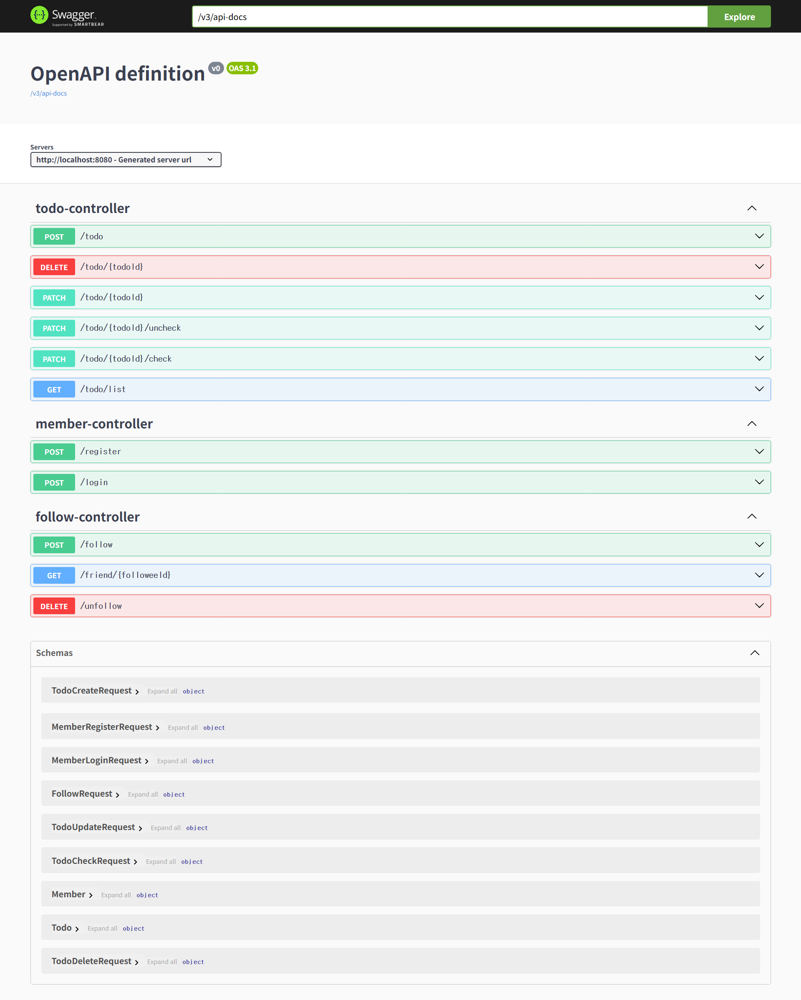

# Week 6 WIL

## 1. 요청 데이터의 유효성 검증 (Validation)

### 유효성 검사란?
- DTO 단에서 요청 데이터의 **형식(길이, 포맷 등)** 을 사전에 검사
- 예: `content`가 100자를 초과하면 저장 전에 에러 반환

### 왜 필요한가?
- **불필요한 DB 접근 방지** 및 서버 자원 절약
- **400 Bad Request** 등 명확한 상태 코드 제공

### 적용 방법
- 의존성 추가:
  ```gradle
  implementation 'org.springframework.boot:spring-boot-starter-validation'
  ```
* DTO에 어노테이션 추가:
  ```java
  @Length(max = 100, message = "content 길이는 100자 이하입니다.")
  private String content;
  ```
* 컨트롤러에서 `@Valid` 사용:

  ```java
  public ResponseEntity<Void> createTodo(@RequestBody @Valid TodoCreateRequest request) { ... }
  ```

---

## 2. Global Exception Handler로 예외 처리

### 예외 처리란?

* 서버에서 발생한 예외를 **일관된 에러 응답 형태로 반환**

### Global Exception Handler

* `@ControllerAdvice` 사용
* 공통 에러 응답 클래스를 만들어 다양한 예외를 처리

  ```java
  @ExceptionHandler(Exception.class)
  public ResponseEntity<ErrorResponse> handleException(Exception e) { 
    return ResponseEntity.internalServerError().body(new ErrorResponse(e.getMessage()));
   }
  ```

---

## 3. AOP를 활용한 예외 처리 구조 이해

### AOP란?

* **Aspect-Oriented Programming** (관점 지향 프로그래밍)
* 공통 관심사(예: 에러 처리)를 **모듈로 분리**

### 핵심 개념

* **Aspect**: 공통 기능 (예: 에러 처리)
* **Join Point**: Aspect가 적용되는 지점 (예: 컨트롤러 실행)
* **Advice**: Join Point에서 실행할 로직

### 적용 예

* `@ControllerAdvice`: 모든 컨트롤러의 예외 처리 Aspect
* `@Transactional`: 서비스 계층의 트랜잭션 관리 Aspect

---

## 4. 커스텀 예외 처리

### 커스텀 예외 클래스 정의

* `RuntimeException`을 상속하여 애플리케이션에 맞는 예외 생성

  ```java
  public class BadRequestException extends RuntimeException {
    public BadRequestException(String message) {
        super(message);
    }
  }
  ```

### 예외 발생과 처리

* 서비스에서 예외 발생:

  ```java
  if (member == null) {
            throw new BadRequestException("멤버가 존재하지 않습니다.");
  }
  ```
* Global Exception Handler에서 처리:

  ```java
  @ExceptionHandler(BadRequestException.class)
  public ResponseEntity<ErrorResponse> handleBadRequestException(BadRequestException e) {
      return ResponseEntity.badRequest().body(new ErrorResponse(e.getMessage()));
  }
  ```

---

## 5. 예외 메시지 클래스 리팩토링

### 문제점

* 에러 메시지가 여러 곳에 **하드코딩**되어 있어 관리가 어려움

### 해결 방법

* 메시지를 상수화한 클래스로 분리:

  ```java
  public class ErrorMessage {
      public static final String MEMBER_NOT_EXISTS = "멤버가 존재하지 않습니다.";
  }
  ```

---

## 6. API 문서화

### 목적

* 백엔드 API의 명세를 문서화하여 **프론트엔드 협업에 활용**

### 사용 도구

* `springdoc-openapi` + `Swagger UI`

  ```gradle
  implementation 'org.springdoc:springdoc-openapi-starter-webmvc-ui:2.8.8'
  ```
* 문서 주소:
  [http://localhost:8080/swagger-ui/index.html](http://localhost:8080/swagger-ui/index.html)

### 문서화 예시

* `@ApiResponse` 등을 이용해 응답 상태 코드 설명 가능
* Swagger UI에서 API 테스트까지 가능

---

## 7. 과제

과제는 방학에 마저... 해보겠습니다...



---