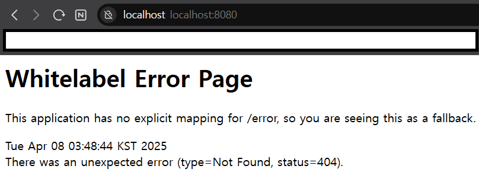

# Week1 WIL
## **웹**
- 여러 컴퓨터가 연결되어 정보를 공유하는 공간
- 일반적인 형태는 **클라이언트-서버** 패러다임

## **클라이언트 - 서버**
- **클라이언트**: 데이터의 **생성/조회/수정/삭제 요청**을 전송
- **서버**: 요청대로 동작을 수행하고 **응답**을 전송

## **HTTP**
- **네트워크 안에서 데이터를 주고받기 위한 규칙(프로토콜)**
- 주요 구성:
  - **HTTP Method**: 데이터를 다루는 방법 (동사)
    - `GET` : 데이터를 가져온다 (조회)
    - `POST` : 데이터를 게시한다 (생성)
    - `PUT` : 데이터를 교체한다 (수정)
    - `PATCH` : 데이터를 수정한다 (수정)
    - `DELETE` : 데이터를 삭제한다 (삭제)
  - **URL**: 다룰 데이터의 위치 (목적어)
    - `scheme` : 프로토콜 (예: `http`)
    - `domain` : 서버 주소 (예: `www.example.com`)
    - `path` : 서버 내 데이터 위치 (예: `/user/1/nickname`)
    - `Path Parameter` : URL의 일반화된 표현 방법 (예: `{user_id}`)
    - `Query String` : (예: `?page=1&keyword=hello`)
  - **헤더**: 통신에 대한 정보 (언제, 누가, 어떻게 보냈는지 등)
  - **바디**: 주고 받으려는 데이터 (보통 JSON 형식)
  - **상태 코드**: 요청에 대한 처리 결과 표시
    - `200` : 처리 성공 (ok)
    - `201` : 데이터 생성 성공 (created)
    - `400` : 클라이언트 요청 오류 (bad request)
    - `404` : 요청 데이터 없음 (not found)
    - `500` : 서버 에러 (internal server error)

## **프론트엔드 - 백엔드**
- **프론트엔드(Frontend)**: 사용자가 보는 화면 (브라우저 등)
- **백엔드(Backend)**: 실제 데이터 처리 및 저장 담당
- 프론트는 자주 변하지 않는 **UI**, 백엔드는 자주 바뀌는 **데이터** 처리
- 프론트는 백엔드에게 **HTTP 요청**을 보내 데이터를 받아 화면에 출력

## **API**
- 어플리케이션과 소통하는 방법(창구)를 정의한 것
- **백엔드 API**: 프론트가 요청을 보낼 때 사용할 HTTP method, URL, 응답 구조 등을 정의한 것
- **REST API**: URL은 명사로, HTTP method는 동사로 구성된 대표적인 API 설계 스타일

## API 명세서

- 유저 회원가입 / 로그인인
    - 회원가입 : `POST`, `/register`
    - 로그인 : `POST`, `/login`
    - 로그아웃 : `POST`, `/logout`
- 나의 할 일 생성 / 조회 / 수정 / 삭제
    - 할 일 생성 : `POST`, `/todo`
    - 할 일 전체 조회 : `GET`, `/todo/list`
    - 할 일 조회 : `GET`, `/todo/{todo_id}`
    - 할 일 수정 : `PUT`, `/todo/{todo_id}`
    - 할 일 삭제 : `DELETE`, `/todo/{todo_id}`
- 나의 할 일 체크 / 체크 해제
    - 할 일 체크 : `POST`, `/todo/{todo_id}/check`
    - 할 일 체크 해제 : `POST`, `/todo/{todo_id}/uncheck`
- 친구 찾기 / 팔로우 / 언팔로우 / 나의 친구 리스트 조회
    - 친구 찾기 : `POST`, `/friend/find`
    - 친구 팔로우 : `POST`, `/friend/follow`
    - 친구 언팔로우 : `POST`, `/friend/unfollow`
    - 친구 리스트 조회 : `GET`, `/friend/list`
- 특정 친구의 할 일 조회
    - 특정 친구의 할 일 전체 조회 : `GET`, `/friend/{friend_id}/todo/list`
    - 특정 친구의 할 일 조회 : `GET`, `/friend/{friend_id}/todo/{todo_id}`

## 스프링 개발환경 준비

