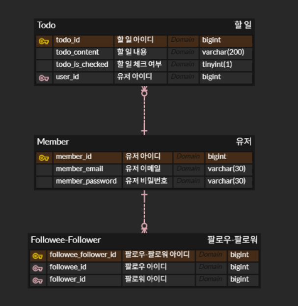
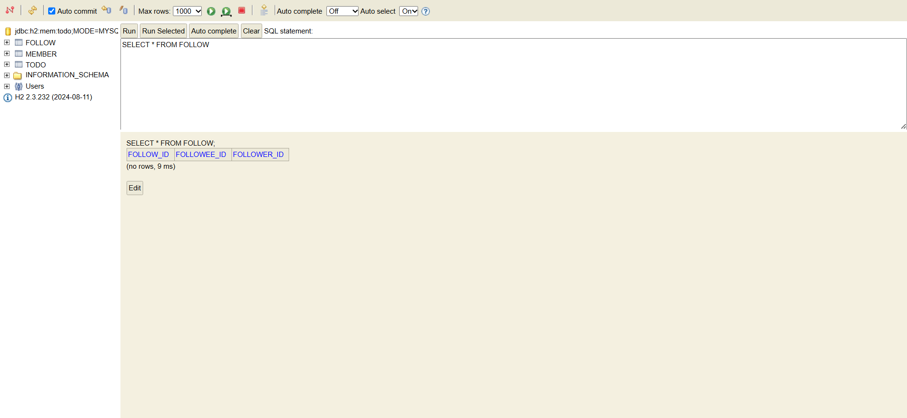

# Week3 WIL
## 데이터베이스 설계 (ERD 설계 및 관계 매핑)
### ER 모델과 ERD의 개념
- **ER 모델(Entity-Relationship Model)**: 문제 상황을 **개체**(Entity)와 **관계**(Relationship)로 표현하여 데이터 구조를 설계하는 방식
- **ERD(Entity-Relationship Diagram):** ER Model을 시각적으로 표현한 다이어그램
    - 개체 → 사각형, 관계 → 마름모꼴

### 주요 구성 요소
- **속성(Attribute)**: 개체/관계가 가지는 특성 (예: 이름, 이메일, 생성일 등)
- **기본키(Primary Key, PK)**: 개체를 유일하게 식별할 수 있는 속성
- **외래키(Foreign Key, FK)**: 다른 엔티티를 참조하기 위한 키

### 관계 표현과 구현 방법
- **ER Model의 데이터베이스 구현**: 개체는 테이블로, 관계는 테이블 또는 외래키로, 속성은 테이블 컬럼으로 구현
- **1:N 관계 구현**: 일반적으로 외래키(FK)로 구현
- **N:M 관계 구현**: 중간 테이블을 사용하여 1:N과 1:M 관계로 분리하여 구현현

### 예시: Todomate 서비스 ERD 초안

---

## JPA (Java Persistence API) 개념 및 적용
### JPA란?
- **정의:**  데이터베이스와 자바 객체를 매핑하는 자바 표준 기술 **ORM(Object Relational Mapping)**
- **기능**: SQL을 직접 장성하지 않고도 데이터베이스 작업 가능
- **기본 단위**: 엔티티(Entity) 객체

### Entity 설계 규칙 및 어노테이션
- `@Entity`: 해당 클래스가 DB 테이블과 매핑된다는 것을 명시
- `@Id`: 기본키 지정
- `@GeneratedValue(strategy = GenerationType.IDENTITY)`: DB에서 PK를 자동 생성
- `@Column`: 컬럼 속성 명시
- 외래키 관계 표현:
    - `@JoinColumn(name = "member_id")`
    - `@ManyToOne(fetch = FetchType.LAZY)`

### 과제
