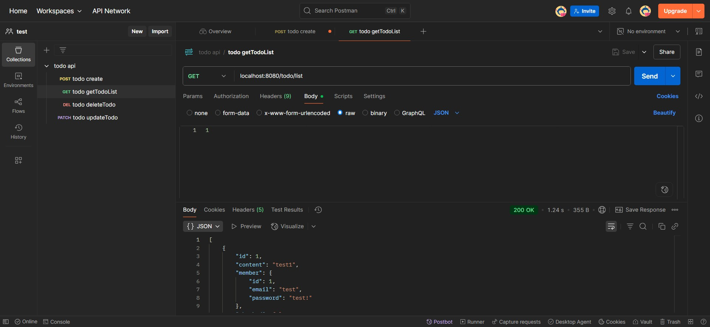

# Week5 WIL

## 서비스 계층 (Service Layer)
- **비즈니스 로직**이 담기는 핵심 계층
- 레포지토리 계층과 소통하여 엔티티 또는 DTO로 데이터 처리
- `@Service`: 서비스 클레스를 스프링 빈으로 등록

- **원자성**: 서비스 계층의 하나의 메서드는 더 이상 쪼갤 수 없는 원자성을 가져야한다.
- `@Transactional` 어노테이션으로 원자성 보장
    - `@Transaction(readOnly = true)` 사용하여 데이터 변경 방지

## 컨트롤러 계층 (Controller Layer)
- 클라이언트의 요청을 받고 응답을 보내는 계층
- 서비스 계층과 DTO를 통해 데이터 소통
- **DTO**: 계층 간 데이터 전송용 객체
- **클래스**
    - `@Controller`: 뷰를 반환하는 컨트롤러
    - `@RestController`: 데이터를 반환하는 컨트롤러
    - `@RequestMapping`: 공통 ULR 매핑
- **메서드**
    - `@PostMapping`: POST 요청 처리
    - `@GetMapping`: GET 요청 처리
    - `@PatchMapping`: PATCH 요청 처리
    - `@DeleteMapping`: DELETE 요청 처리
- **파라미터**
    - `@RequestBody`: HTTP 요청 본문의 JSON을 자바 객체로 변환
    - `@PathVariable`: URL 경로 변수를 메서드 매개변수로 받음

## API 테스트
- Postman을 활용하여 테스트한다.
